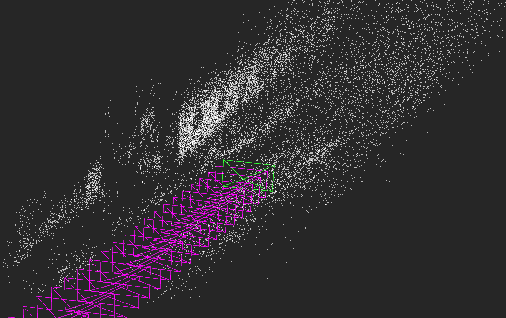
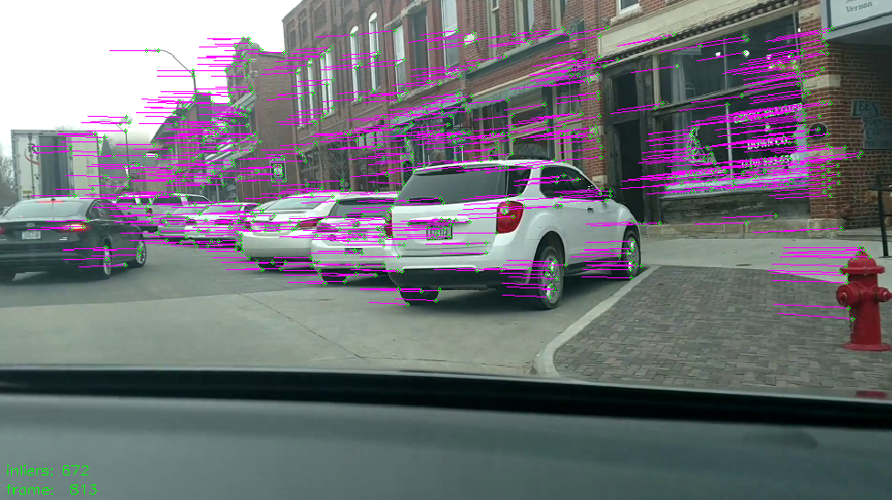
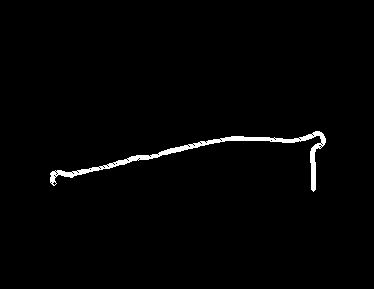
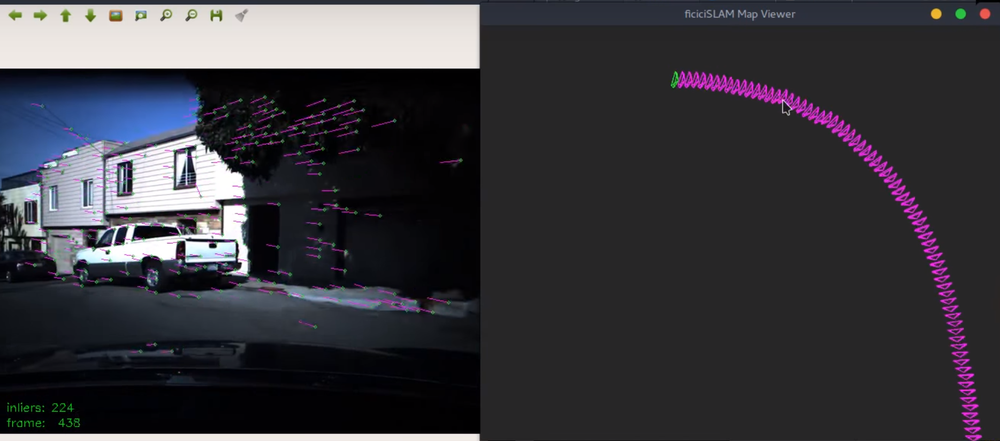
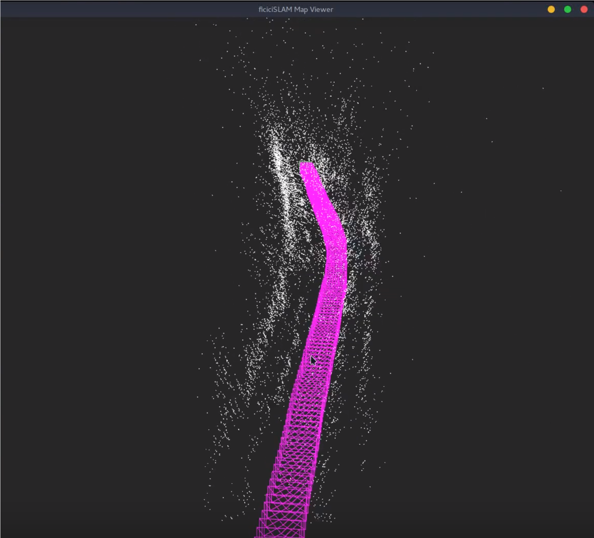

# ficiciSLAM

A crappy visual SLAM implementation I'm working on to learn stuff. Still a work in progress.

big refactor coming soon

[video playlist](https://www.youtube.com/playlist?list=PLz9N52s5FSIUFNoLjyNy_9EW42Ngy6ipn)

<!---

  
  

  
  

--->
## todo
   - add keyframes
   - refactor everything
   - figure out what bundle adjustment is

## how to use
   - not sure if I can share the datasets i'm using, so just put any video file in the `vids/` folder

   - currently only have visual odometry barely working, so just run `python stream.py` to see it working

want to learn more about slam/visual odometry?
---
   - check out Multiple View Geometry by Hartley & Zissermann
   - [Avi Singh's visual odometry projects](https://github.com/avisingh599/mono-vo)
   - [twitchslam by geohot](https://github.com/geohot/twitchslam)
   - [UZH and ETH Zurich's course (Vision Algorithms for Mobile Robotics)](https://web.archive.org/web/20171231011504/http://rpg.ifi.uzh.ch/teaching.html)
   - S-PTAM, PTAM, ORB-SLAM, LSD-SLAM
     - papers and code are super useful
   - OpenCV references in API documentation
     - look in the SFM modules

## dependencies
   - OpenCV
   - Numpy
   - Scikit-image
   - pangolin (we use uoip's fork for its bindings, since its a bit more python-friendly and intuitive)
      - https://github.com/uoip/pangolin

## LOICENSE

MIT license. Do what you want with it, but please attribute my work if you do. Also don't sue me.
